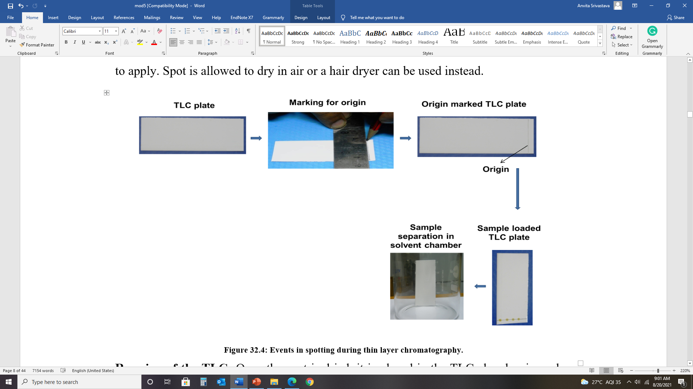
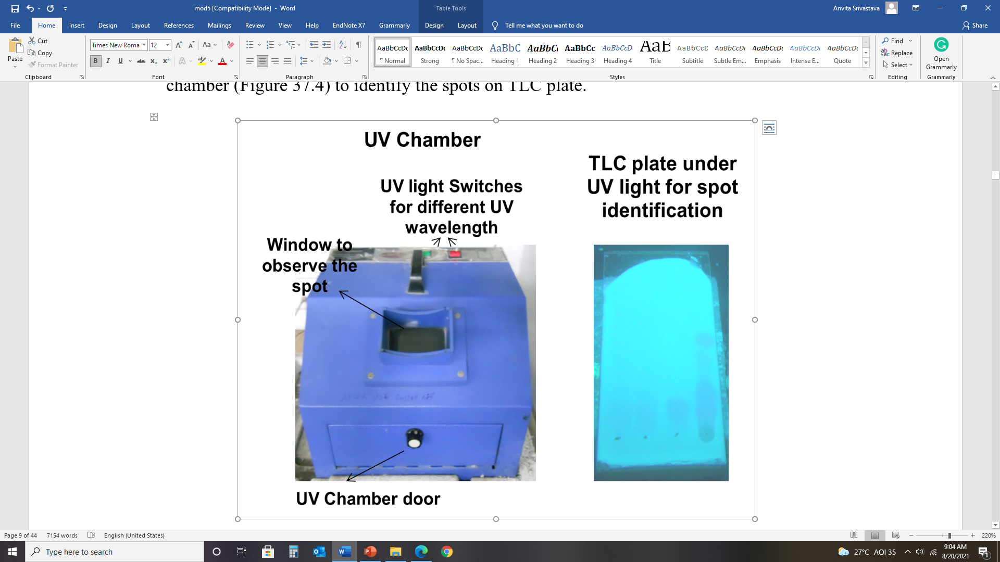
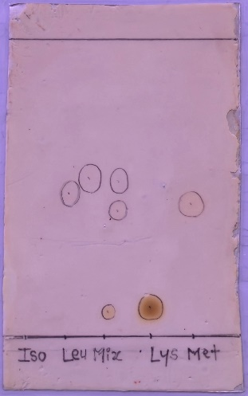
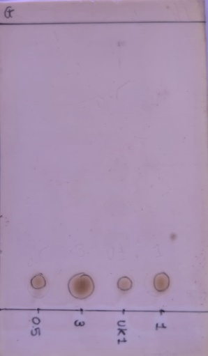
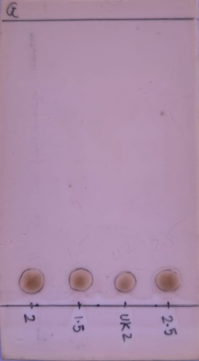

### Procedure

**Operation of the technique-** Several steps are required to perform a thin layer chromatography to analyze a complex sample. These preparatory and operational steps are as follows:

<b>Figure 2: Steps involved in Thin Layer Chromatography (TLC)</b>

### Step 1: Spotting

1. A line is drawn with a pencil little away from the bottom.
2. Sample is taken into the capillary tube or in a pipette.
3. Capillary is touched onto the silica plate and sample is allowed to dispense.
4. It is important that depending on the thickness of the layer, a suitable volume should be taken to apply.
5. Spot is allowed to dry in air or a hair dryer can be used instead.

### Step 2: Running of the TLC

Once the spot is dried, it is placed in the TLC chamber in such a way that spot should not be below the solvent level. Solvent front is allowed to move until the end of the plate.

### Step 3: Analysis of the chromatography plate

The plate is taken out from the chamber and air dried. If the compound is colored, it forms spot and for these substances there is no additional staining required.

There are two methods of developing a chromatogram-

**3.1 Staining procedure-** In the staining procedure, TLC plate is sprayed with the staining reagent to stain the functional group present in the compound. For example, ninhydrin is used to stain amino acids.

**3.2 Non-staining procedure-** In non-staining procedure spot can be identified by following methods-

**3.2.1 Autoradiography-** A TLC plate can be placed along with the X-ray film for 48-72 hrs (exposure time depends on type and concentration of radioactivity) and then X-ray film is processed.

**3.2.2 Fluorescence-** Several heterocyclic compounds give fluorescence in UV due to presence of conjugate double bond system. TLC plate can be visualized in a UV-chamber (Figure 3) to identify the spots on TLC plate.

<b>Figure 3: Visualization of TLC plate under UV chamber</b>

**Result:**

**Steps to identify amino acids:**

1. Run standard amino acids along with unknown amino acid on TLC plate (Figure 4).
2. Calculate Rf values for standard amino acids as well as unknown sample (Table 1).

<b>Figure 4: The separation of a mixture of amino acids on TLC Plate</b>

3. Compare Rf values and it will help you to identify the amino acids in unknown sample.

### Table 1: Calculation of Rf Values

| SNo. | Amino Acids | Distance travelled by Sample | Distance travelled by Solvent | Normalized Rf Values |
| ---- | ----------- | ---------------------------: | ----------------------------: | -------------------: |
| 1  | Alanine       | 0.265 | 6.8 | 0.2728 |
| 2  | Arginine      | 0.69  | 6.8 | 0.1498 |
| 3  | Aspartic Acid | 1.79  | 6.8 | 0.2573 |
| 4  | Cysteine      | 0.69  | 6.8 | 0.1014 |
| 5  | Glycine       | 1.3   | 6.0 | 0.2456 |
| 6  | Glutamic Acid | 1.0   | 6.0 | 0.2819 |
| 7  | Histidine     | 0.5   | 6.0 | 0.1152 |
| 8  | Isoleucine    | 4.2   | 7.0 | 0.5719 |
| 9  | Leucine       | 4.4   | 7.0 | 0.6115 |
| 10 | Lysine        | 0.8   | 7.0 | 0.1137 |
| 11 | Methionine    | 2.8   | 6.4 | 0.4798 |
| 12 | Phenylalanine | 3.9   | 7.8 | 0.5895 |
| 13 | Proline       | 1.7   | 7.8 | 0.2611 |
| 14 | Serine        | 0.9   | 6.3 | 0.2389 |
| 15 | Threonine     | 3.9   | 6.3 | 0.2876 |
| 16 | Tryptophan    | 3.9   | 6.3 | 0.6405 |
| 17 | Tyrosine      | 3.0   | 6.3 | 0.5288 |
| 18 | Valine        | 2.4   | 6.3 | 0.4235 |
| 19 | Unknown A     | 3.3   | 6.4 | 0.563  |
| 20 | Unknown B     | 2.7   | 6.4 | 0.461  |
| 21 | Unknown C     | 0.5   | 6.4 | 0.085  |

**Result (A):**

- The compound A in mixture is **Isoleucine**
- The compound B in the mixture is **Methionine**
- The compound C in the mixture is **Cysteine**

**Steps to determine the concentration of unknown amino acid:**

1. Run different concentrations of standard amino acids along with unknown concentration amino acids on a TLC plate (Table 2).
2. Calculate the area of the spot for the standard as well as the unknown sample.
3. The concentration of the amino acid is directly proportional to the area of the spot. Plot the area on the Y-axis and the concentration of standard amino acids on the X-axis (Figure 6). Deduce the equation.
4. Using the equation, determine the concentration of amino acids in the unknown sample.

<b>Figure 5: Thin-layer chromatography runs for different concentrations of Lysine with the unknown sample.</b>

### Table 2: Calculation of Area corresponding to amino acid concentrations

| SNo. | Amino Acid Sample | Volume (µL) | Amount (µg) | Area (cm²) |
| ---- | ----------------- | ----------: | ----------: | ---------: |
| 1 | Standard 1      | 0.5 | 0.005 | 9  |
| 2 | Standard 2      | 1   | 0.010 | 10 |
| 3 | Standard 3      | 1.5 | 0.015 | 18 |
| 4 | Standard 4      | 2   | 0.020 | 24 |
| 5 | Standard 5      | 2.5 | 0.025 | 26 |
| 6 | Standard 6      | 3   | 0.030 | 28 |
| 7 | Unknown Sample  | 1   | -     | 7  |
| 7 |                 | 2   | -     | 11 |

**Calculations:**

**a. For Excel graph:**

Equation of curve: $x = \frac{y - 4.2667}{851.43}$ µg

∴ Unknown sample with volume applied as 1 µl;

∴ $x_1 = \frac{7 - 4.2667}{851.43}$ …. (y = 7 mm²)

∴ $x_1 = 0.003$ µg …. (For 1 µl)

∴ Amount for 1 ml = $0.003 \times 1000$

∴ Amount for 1 ml = $3$ µg i.e. (3 µg/ml)

Similarly, unknown sample with volume applied as 2 µl;

∴ $x_2 = \frac{11 - 4.2667}{851.43}$ …. (y = 11 mm²)

∴ $x_2 = 0.0079$ µg …. (for 2 µl)

∴ Amount for 1 ml = $\frac{0.0079}{2} \times 100$

∴ Amount for 1 ml = $3.95$ µg i.e. (3.95 µg/ml)

∴ Actual concentration = $(3 + \frac{3.95}{2}) = 3.48$ µg/ml

**b. From graph paper:**

∴ Actual concentration = $3.7 + \frac{4}{2} = 3.85$ µg/ml

**Result (B):**

The concentration of unknown from the sample is **3.48 µg/ml**
