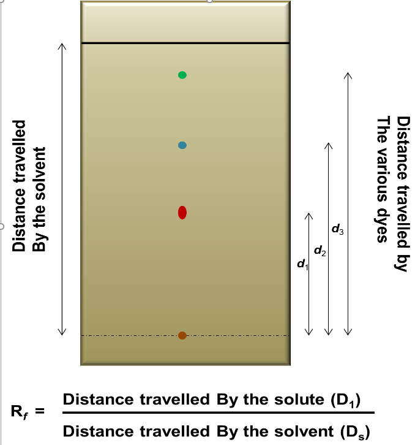

The thin layer chromatography technique is an analytical chromatography to separate and analyze free amino acids from proteins. In this method, the silica or alumina as a stationary phase is coated on to a glass or aluminum foil as thin layer and then a sample is allowed to run in the presence of a mobile phase (solvent). In comparison to other chromatography techniques, the mobile phase runs from bottom to top by diffusion (in most of the chromatography techniques, mobile phase runs from top to bottom by gravity or pump). As sample runs along with the mobile phase, it gets distributed into the solvent phase and stationary phase (Figure 1). The interaction of sample with the stationary phase retard the movement of the molecule whereas mobile phase implies an effective force onto the sample.

Suppose the force caused by mobile phase is **Fm** and the retardation force by stationary phase is **Fs**, then effective force on the molecule will be **(Fm - Fs)** through which it will move. The molecule immobilizes on the silica gel (where, Fm = Fs) and the position will be controlled by multiple factors.

1. Nature or functional group present on the molecule or analyte.
2. Nature or composition of the mobile phase.
3. Thickness of the stationary phase.
4. Functional group present on stationary phase.

<b>Rf = $\frac{Distance\ Travelled\ by\ Analyte\ Front\ (d_1)}{Distance\ Travelled\ by\ Solvent\ Front\ (d_s)}$</b>

<b>Figure 1: TLC plate with the separation of amino acids and Rf values</b>

